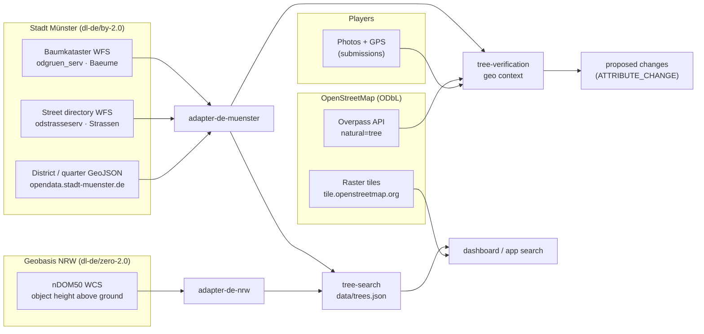

# Data sources

Where every piece of data in OpenQuest comes from, under which license, and which code reads it. Keep this sheet in sync when a source is added or changed; the app's attribution must cover every row marked **attribution required**.

Status: 2026-09-25. Model of the data itself: [erd.md](erd.md). Background research: [Research Note 0001](../research/0001-opendata-muenster-baumkataster.md).

## Overview

## Sources

| # | Data | Provider | Access | License | Used by | Refresh |
|---|---|---|---|---|---|---|
| 1 | **Tree inventory**: position, genus (`baumgruppe`), street key (`str_schl`), 43,114 trees | Stadt Münster, Amt für Grünflächen, Umwelt und Nachhaltigkeit (published by the Vermessungs- und Katasteramt) | WFS `https://geo.stadt-muenster.de/mapserv/odgruen_serv`, layer `ms:Baeume` (GeoJSON, CSV, BBOX queries in `EPSG::4326` with lat,lon axis order); portal entry [digitales-baumkataster-münster](https://opendata.stadt-muenster.de/dataset/digitales-baumkataster-m%C3%BCnster) | [dl-de/by-2.0](https://www.govdata.de/dl-de/by-2-0), **attribution required** | `adapter-de-muenster` (`createMuensterTreeProvider`, `parseWfsTrees`), `tree-search/scripts/build-data.ts`, .NET `OpenQuest.Adapters.Muenster` (PR #4) | Live service; data state 2017 (outside the Promenade ring) and 2020 (inside) per the dataset description; no update interval published |
| 2 | **Street names** for `str_schl` (2,049 streets) | Stadt Münster | WFS `https://www.stadt-muenster.de/ows/mapserv706/odstrasseserv`, layer `ms:Strassen` (CSV: `STR_SCHL, NAME, STR_STATUS, STR_RW, STR_HW`) | dl-de/by-2.0, **attribution required** | `adapter-de-muenster` (`fetchStreetNames`) | At data build |
| 3 | **City districts** (6 Stadtbezirke) | Stadt Münster | `https://opendata.stadt-muenster.de/sites/default/files/stadtbezirke-muenster.geojson` (CRS84) | dl-de/by-2.0, **attribution required** | `adapter-de-muenster` (`fetchDistricts`) | At data build |
| 4 | **Quarters** (45 statistical districts) | Stadt Münster | `https://opendata.stadt-muenster.de/sites/default/files/stadtteile-statistische-bezirke-muenster.geojson` (CRS84) | dl-de/by-2.0, **attribution required** | `adapter-de-muenster` (`fetchQuarters`) | At data build |
| 5 | **Tree heights**: normalized digital surface model nDOM50 (object height above ground, 0.5 m grid, image based surface model from summer flights minus laser scanning terrain model) | Geobasis NRW (Bezirksregierung Köln) | WCS `https://www.wcs.nrw.de/geobasis/wcs_nw_ndom`, coverage `nw_ndom`, EPSG:25832, GeoTIFF float32, max 4000 × 4000 px per request; [dataset](https://open.nrw/dataset/aa8f6bf6-1e2e-45bb-9b56-88b47e49cb2c) | [dl-de/zero-2.0](https://www.govdata.de/dl-de/zero-2-0), no conditions (we still credit it) | `adapter-de-nrw` (`sampleTreeHeights`: 95th percentile within 2.5 m of each tree, one request per 50 m cell, 10,314 requests, resumable cache), `tree-search` data build | Flight cycles of the state survey; rebuild `trees.json` to pick up new flights |
| 6 | **OSM trees** (`natural=tree`, `genus`, `species`; ~13k in Münster, ~3 % with genus) | OpenStreetMap contributors | Overpass API (`overpass-api.de`, fallback `maps.mail.ru`, `overpass.kumi.systems`), `around` queries, cached | [ODbL 1.0](https://opendatacommons.org/licenses/odbl/), **attribution required**; mixing into our data makes the combined data ODbL | `tree-verification` (`createOsmTreeProvider`, geo context only) | Live, per verification |
| 7 | **Base map** | OpenStreetMap contributors | Raster tiles `https://tile.openstreetmap.org/{z}/{x}/{y}.png` ([tile usage policy](https://operations.osmfoundation.org/policies/tiles/)) | ODbL / tiles CC BY-SA, **attribution required** | `apps/dashboard` | Live |
| 8 | **Player contributions**: photos, GPS position, timestamps, model assessments | OpenQuest players | App upload (PR #4 backend, `MEDIA`, `SUBMISSION`) | Own data; license for publication still to be decided (proposal: CC BY 4.0 or dl-de/by-2.0 compatible) | `tree-verification` → `proposedChanges` → `ATTRIBUTE_CHANGE` / export | Continuous |
| 9 | **Evaluation photos** (42, hand checked) | Wikimedia Commons authors (per file in `eval/samples.json`) | Commons API, downloaded to `eval/images` (gitignored) | Per file (mostly CC BY / CC BY-SA), attribution per file | `eval/` only, never shipped | Manual |

### Derived data

| Data | Built from | Where | Notes |
|---|---|---|---|
| `packages/tree-search/data/trees.json` (2.4 MB, columnar) | 1 + 2 + 3 + 4 + 5 | committed | Stable tree id = SHA-1 of the coordinate (7 decimals); genus normalized (placeholders like `Baum Amt62` → `null`, typos fixed); height in decimeters |
| Assessments, genus suggestions, missing / new tree candidates | 8, checked against 1 and 6 | `proposedChanges` of `verifyTreePhoto()` | Always proposals; hazards, missing trees and new assets need review ([ADR-0005](../adr/0005-tree-assessment-from-player-photos.md)) |

## Processing services (not data sources)

| Service | Purpose | Data sent |
|---|---|---|
| OpenRouter: `google/gemini-3.8-flash`, `google/gemini-3.5-flash-lite`, `openai/gpt-6-luna` | Photo verification and assessment ([ADR-0002](../adr/0002-tree-photo-verification.md)) | Photo pixels only (no EXIF, no user data) |
| OpenRouter: `typesafe/jev-1.13` (Jev, TypeSafe AI) | Decisions over structured evidence; search query interpretation | Model observations, nearby tree summary, search text |

## Attribution text

Shown in the app footer / map attribution, and required in every export:

> Baumdaten: Stadt Münster, Digitales Baumkataster, [dl-de/by-2-0](https://www.govdata.de/dl-de/by-2-0) · Straßen und Stadtteile: Stadt Münster, dl-de/by-2-0 · Höhen: Geobasis NRW, nDOM50, [dl-de/zero-2-0](https://www.govdata.de/dl-de/zero-2-0) · Karte und Vergleichsbäume: © [OpenStreetMap](https://www.openstreetmap.org/copyright)-Mitwirkende · Daten verändert und angereichert durch OpenQuest.

Rules from the Münster terms of use: no city logos or coat of arms, no official looking design, no impression that the city endorses the app.

## Known quality issues

- **Inventory**: ~8 % placeholders instead of a genus (`Baum Amt62` 2,832, `Baumgruppe` 412, `Standort` 227, empty 103); a few typos; 5 four digit street keys; 48 point pairs closer than 1 m; only about half of the city's ~100,000 trees; no species, age or size.
- **Heights (nDOM50)**: height at the inventory point, not a measured tree height. A tree next to a tall building can pick up the building (e.g. 39 to 40 m entries at Kanalstraße); values below 2 m usually mean a young, pruned or missing tree. Summer flights, so deciduous crowns are included.
- **OSM**: sparse genus coverage in Münster; used only as supporting context.
