# Data model (ERD)

Status: **draft** — first version for discussion. Target database: PostgreSQL + PostGIS.

The model has four areas:

1. **Open data** — generic assets (trees today, anything with a location tomorrow) and where they come from.
2. **Users** — accounts, roles, credentials.
3. **Quests** — quests, claims, submissions, photos, review.
4. **Write-back & gamification** — attribute changes derived from approved submissions, exports to the city, points and badges.

```mermaid
erDiagram
    %% ───────────── Open data ─────────────
    DATA_SOURCE ||--o{ ASSET : provides
    DATA_SOURCE ||--o{ SYNC_RUN : "is synced by"
    SYNC_RUN ||--o{ ASSET_SNAPSHOT : records
    ASSET ||--o{ ASSET_SNAPSHOT : "has history"
    ASSET_TYPE ||--o{ ASSET : classifies
    ASSET_TYPE ||--o{ ASSET_TYPE_TASK_TYPE : allows
    TASK_TYPE ||--o{ ASSET_TYPE_TASK_TYPE : "is allowed for"

    %% ───────────── Users ─────────────
    USER ||--o{ USER_RECOVERY_CODE : "can recover with"

    %% ───────────── Quests ─────────────
    USER ||--o{ QUEST_CAMPAIGN : creates
    QUEST_CAMPAIGN |o--o{ QUEST : groups
    ASSET ||--o{ QUEST : "is target of"
    TASK_TYPE ||--o{ QUEST : "defines task of"
    USER ||--o{ QUEST : creates
    QUEST ||--o{ CLAIM : "is claimed via"
    USER ||--o{ CLAIM : makes
    CLAIM ||--o| SUBMISSION : "results in"
    SUBMISSION ||--o{ MEDIA : contains
    USER |o--o{ SUBMISSION : reviews

    %% ───────────── Write-back ─────────────
    SUBMISSION ||--o{ ATTRIBUTE_CHANGE : proposes
    ASSET ||--o{ ATTRIBUTE_CHANGE : "is changed by"
    EXPORT_RUN |o--o{ ATTRIBUTE_CHANGE : "exports"
    DATA_SOURCE ||--o{ EXPORT_RUN : "receives"
    USER ||--o{ EXPORT_RUN : triggers

    %% ───────────── Gamification ─────────────
    USER ||--o{ POINT_TRANSACTION : earns
    SUBMISSION |o--o{ POINT_TRANSACTION : "rewards"
    USER ||--o{ USER_BADGE : holds
    BADGE ||--o{ USER_BADGE : "is awarded as"

    DATA_SOURCE {
        uuid id PK
        varchar key UK "e.g. de-muenster-trees"
        varchar adapter_key "adapter implementation, e.g. de-muenster"
        varchar name
        varchar city
        varchar source_url
        varchar license "e.g. dl-de/by-2.0"
        text attribution "shown in the app"
        jsonb config "adapter-specific settings"
        boolean is_active
        timestamptz created_at
    }

    SYNC_RUN {
        uuid id PK
        uuid data_source_id FK
        timestamptz started_at "= fetched_at of the snapshot"
        timestamptz finished_at
        varchar status "running | succeeded | failed"
        varchar snapshot_key "full raw download in S3 / MinIO"
        varchar schema_hash "source fields; a change fails the run"
        int record_count "records in the download"
        int assets_created
        int assets_updated
        int assets_removed
        text error
    }

    ASSET_SNAPSHOT {
        uuid id PK
        uuid asset_id FK "UK with sync_run_id"
        uuid sync_run_id FK
        varchar change_type "created | updated | removed"
        geography geom "position in this version"
        jsonb raw "source record in this version"
        varchar source_hash
    }

    ASSET_TYPE {
        uuid id PK
        varchar key UK "tree | bench | playground | ..."
        varchar name "i18n key"
        varchar icon
        jsonb attribute_schema "JSON Schema of ASSET.attributes"
    }

    ASSET {
        uuid id PK
        uuid asset_type_id FK
        uuid data_source_id FK
        varchar external_id "UK with data_source_id"
        geography geom "PostGIS, WGS84 (4326)"
        jsonb attributes "normalized, validated by attribute_schema"
        jsonb raw "original source record"
        varchar source_hash "detects changes on sync"
        varchar status "active | removed_at_source"
        timestamptz first_seen_at
        timestamptz last_seen_at
        timestamptz updated_at
    }

    TASK_TYPE {
        uuid id PK
        varchar key UK "photo | verify_attribute | measure | condition_report"
        varchar name "i18n key"
        jsonb config_schema "JSON Schema of QUEST.task_config"
        jsonb result_schema "JSON Schema of SUBMISSION.payload"
    }

    ASSET_TYPE_TASK_TYPE {
        uuid asset_type_id PK, FK
        uuid task_type_id PK, FK
    }

    USER {
        uuid id PK
        varchar username UK
        varchar password_hash "argon2id, never plain text"
        varchar role "player | moderator | admin"
        varchar display_name
        varchar locale "e.g. de"
        int total_points "cache of POINT_TRANSACTION sum"
        timestamptz last_login_at
        timestamptz created_at
        timestamptz deleted_at "soft delete / GDPR anonymization"
    }

    USER_RECOVERY_CODE {
        uuid id PK
        uuid user_id FK
        varchar code_hash "argon2id, code shown once at sign-up"
        timestamptz used_at "null = still valid, single use"
        timestamptz created_at
    }

    QUEST_CAMPAIGN {
        uuid id PK
        uuid created_by FK
        varchar title
        text description
        jsonb asset_filter "filter used to generate the quests"
        timestamptz created_at
    }

    QUEST {
        uuid id PK
        uuid campaign_id FK "nullable"
        uuid asset_id FK
        uuid task_type_id FK
        uuid created_by FK
        varchar title
        text description
        jsonb task_config "e.g. which attribute to verify"
        int max_completions "X: how often the quest can be done"
        int slots_taken "active claims + pending/approved submissions"
        int reward_points
        int geofence_radius_m "e.g. 30"
        int claim_ttl_minutes "claim expires after this"
        varchar status "draft | active | paused | full | closed"
        timestamptz starts_at
        timestamptz ends_at
        timestamptz created_at
    }

    CLAIM {
        uuid id PK
        uuid quest_id FK
        uuid user_id FK
        varchar status "active | submitted | expired | cancelled"
        timestamptz claimed_at
        timestamptz expires_at
        timestamptz closed_at
    }

    SUBMISSION {
        uuid id PK
        uuid claim_id FK, UK
        jsonb payload "task result, validated by result_schema"
        geography location "player position at submit time"
        float distance_m "distance to asset, geofence check"
        varchar status "pending | approved | rejected"
        uuid reviewed_by FK "nullable"
        timestamptz reviewed_at
        text rejection_reason
        timestamptz submitted_at
    }

    MEDIA {
        uuid id PK
        uuid submission_id FK
        varchar storage_key "object key in S3 / MinIO"
        varchar mime_type
        int width
        int height
        int size_bytes
        varchar sha256 "exact duplicate detection"
        varchar phash "perceptual hash, near-duplicate detection"
        timestamptz captured_at "from EXIF, before EXIF is stripped"
        timestamptz created_at
    }

    ATTRIBUTE_CHANGE {
        uuid id PK
        uuid submission_id FK
        uuid asset_id FK
        varchar attribute_key "e.g. genus, photo_url, condition"
        jsonb old_value
        jsonb new_value
        varchar status "proposed | accepted | exported | discarded"
        uuid export_run_id FK "nullable"
        timestamptz created_at
    }

    EXPORT_RUN {
        uuid id PK
        uuid data_source_id FK
        uuid created_by FK
        varchar format "csv | geojson | api"
        varchar storage_key "exported file"
        varchar status "running | succeeded | failed"
        int change_count
        timestamptz created_at
    }

    POINT_TRANSACTION {
        uuid id PK
        uuid user_id FK
        uuid submission_id FK "nullable"
        int amount "may be negative"
        varchar reason "quest_approved | badge | correction | ..."
        timestamptz created_at
    }

    BADGE {
        uuid id PK
        varchar key UK
        varchar name "i18n key"
        varchar icon
        jsonb criteria
    }

    USER_BADGE {
        uuid user_id PK, FK
        uuid badge_id PK, FK
        timestamptz awarded_at
    }
```



## Design decisions

### Generic assets instead of a `tree` table

Trees are not modeled as their own table. Every open data object is an **`ASSET`** with a **`ASSET_TYPE`** (`tree`, later `bench`, `playground`, `bike_rack`, …):

- Common fields every object has — location, source, external id, sync state — are real columns.
- Type-specific fields live in `ASSET.attributes` (JSONB) and are validated against `ASSET_TYPE.attribute_schema` (JSON Schema). A new asset type needs **no migration**, only a new `ASSET_TYPE` row and adapter support.
- `ASSET.raw` keeps the untouched source record, so we can re-normalize later without re-downloading.
- `geom` is a PostGIS `geography`. Points today; polygons or lines (e.g. green areas, paths) fit the same column later.
- Frequently filtered attributes can get expression / GIN indexes, e.g. `(attributes->>'genus')`.

Alternative considered: one table per asset type (`tree`, `bench`, …). Rejected because every new data set would need schema changes in core, which contradicts the adapter idea.

### Snapshots and history

Every import is a `SYNC_RUN` (it is the snapshot in the sense of [ADR-0001](../adr/0001-baumkataster-datenbezug-und-rueckkanal.md): `snapshot_id` = `SYNC_RUN.id`, `fetched_at` = `SYNC_RUN.started_at`). History is kept on two levels:

- **Full download:** the unchanged file from the source is stored in object storage (`SYNC_RUN.snapshot_key`). Every snapshot can be reloaded exactly as it was.
- **Changes per asset:** `ASSET_SNAPSHOT` gets a row only when an asset was created, changed (`source_hash` differs) or disappeared at the source. A daily sync of 43k unchanged trees therefore adds no rows, and the state of any asset at any sync can still be reconstructed.

`ASSET` itself always holds the current state. `SYNC_RUN.schema_hash` records the source's field list; if it changes unexpectedly, the run fails loudly instead of importing broken data.

### Where city-specific things live

`DATA_SOURCE` describes one concrete data set of one city and points to the adapter that reads it (`adapter_key`) plus adapter-specific `config`. Core code never branches on city names — see [CLAUDE.md](../../CLAUDE.md).

### One quest = one asset

A quest targets exactly one asset. When an admin creates quests "for all trees in district X", a **`QUEST_CAMPAIGN`** is created and one `QUEST` per matching asset is generated. This keeps `max_completions` unambiguous (per asset) and makes the map simple (one marker per quest).

### Limiting completions (`max_completions`)

- `QUEST.slots_taken` counts active claims plus pending/approved submissions.
- Claiming happens in one transaction: `SELECT … FROM quest WHERE id = $1 FOR UPDATE`, check `slots_taken < max_completions`, insert `CLAIM`, increment `slots_taken`. This prevents two players from taking the last slot at the same time.
- A claim that expires (`expires_at`) or a rejected submission decrements `slots_taken`.
- Constraint: at most one `active` claim per user and quest (partial unique index on `CLAIM(quest_id, user_id) WHERE status = 'active'`).

### Users & passwords

- Only `password_hash` is stored (argon2id). Plain passwords never touch the database or logs.
- **No email address is stored.** Players sign up with username + password only, which keeps the barrier low and avoids personal data. Consequence: there is no password reset via email. Instead, accounts are recovered with **one-time recovery codes** (`USER_RECOVERY_CODE`):
  - At sign-up the player is shown a set of codes once (e.g. 8) and asked to save them. Only their argon2id hashes are stored.
  - With a valid code the player can set a new password. The code is then marked `used_at` and can't be used again.
  - Players can regenerate their codes while logged in; this deletes the old ones.
  - Login and recovery attempts are rate-limited, since codes are the only recovery path.
- `deleted_at` allows GDPR deletion by anonymizing the row while keeping submissions (and the open data they produced) intact.
- Sessions / refresh tokens are left to the auth library we pick and are not modeled here yet.

### From submission to open data

An approved `SUBMISSION` produces `ATTRIBUTE_CHANGE` rows (e.g. `genus: "Baum Amt62" → "Tilia"`, `photo_url: null → …`). We never overwrite `ASSET.attributes` from the city directly with player data — changes are collected and exported via `EXPORT_RUN`, because the city stays the owner of the data. The next sync then brings the city's (possibly updated) values back.

### Points as a ledger

`POINT_TRANSACTION` is append-only; `USER.total_points` is only a cache for fast leaderboards. This makes corrections traceable (e.g. negative amount after a submission is rejected later).

## Münster tree data (`gruen_opendata.csv`)

All sources, licenses and attribution: [data-sources.md](data-sources.md). Source and access are decided in [ADR-0001](../adr/0001-baumkataster-datenbezug-und-rueckkanal.md): the data comes live from the city's WFS (`geo.stadt-muenster.de/mapserv/odgruen_serv`, layer `Baeume`), not from the portal. License dl-de/by-2.0.

Analysis of the CSV export (43,114 rows):

| Column | Example | Meaning | Mapping |
|---|---|---|---|
| `WKT` | `POINT (7.6123466 51.9746341)` | Location, WKT, lon/lat WGS84 | `ASSET.geom` |
| `str_schl` | `02505` | Street key (Straßenschlüssel), 1,067 distinct values, 14 empty | `attributes.street_key` (keep as string, leading zeros!) |
| `baumgruppe` | `Tilia` | Genus (Latin), 74 distinct values | `attributes.genus` |

Findings that affect the model:

- **No id column.** The adapter has to derive a stable `external_id`. On re-sync, points that moved slightly must be matched to the existing asset by nearest neighbour within a small radius (e.g. 1 m), otherwise quests and photos lose their tree. **Question for Stadt Münster:** is there an internal tree number we could get in the export?
  - **Open point, to be settled in ADR-0001:** the ADR hashes coordinate (EPSG:25832, rounded to 0.1 m) + `str_schl` + `baumgruppe`. Including the genus means a tree gets a new id as soon as the city adopts a genus correction made by players, which cuts it off from its quests and photos. Recommendation for OpenQuest: hash the coordinate only.
- **Only the genus, not the species.** Top genera: Tilia 10,279 · Quercus 8,199 · Acer 5,324 · Carpinus 3,448.
- **Unknown / placeholder genus:** 2,832 × `Baum Amt62` and 103 empty values. The adapter normalizes these to `genus = null` (raw value stays in `raw`). These ~2,900 trees are ideal targets for first `verify_attribute` quests.
- Street keys are padded to 5 digits and resolved to street names via the WFS `odstrasseserv`; district and quarter come from the portal's GeoJSON (see ADR-0001, adapter concern).
- The ADR also flags near-duplicates (< 1 m apart) and data quality issues. These go into `attributes.quality_flags`.

Proposed `attribute_schema` for `ASSET_TYPE = tree` (first version):

```json
{
  "type": "object",
  "properties": {
    "genus":        { "type": ["string", "null"], "description": "Latin genus, e.g. Tilia" },
    "species":      { "type": ["string", "null"], "description": "Latin species, not in Münster data yet" },
    "street_key":   { "type": ["string", "null"], "description": "5 digits, zero-padded" },
    "street_name":  { "type": ["string", "null"] },
    "district":     { "type": ["string", "null"], "description": "Stadtbezirk" },
    "quality_flags": { "type": "array", "items": { "enum": ["placeholder_genus", "near_duplicate", "typo_corrected"] } },
    "trunk_circumference_cm": { "type": ["number", "null"] },
    "condition":    { "enum": ["good", "damaged", "dead", "gone", null] },
    "photo_url":    { "type": ["string", "null"] },
    "vitality":     { "enum": ["healthy", "slightly_damaged", "clearly_damaged", "severely_damaged_or_dead", null], "description": "Roloff-like scale, from player photos" },
    "damage":       { "type": "array", "items": { "enum": ["bark_wound", "cavity", "crack", "leaning", "broken_branch", "dead_branches", "root_damage"] } },
    "pests":        { "type": "array", "items": { "enum": ["oak_processionary_nests", "leaf_miner_damage", "mistletoe", "other_pest"] } },
    "age_class":    { "enum": ["young", "semi_mature", "mature", "veteran", null] },
    "tree_pit": {
      "type": ["object", "null"],
      "properties": {
        "surface": { "enum": ["open_soil", "planted", "mulched", "sealed", "grate"] },
        "watering_bag": { "type": "boolean" },
        "stakes": { "type": "boolean" },
        "protection_guard": { "type": "boolean" }
      }
    }
  }
}
```

### Attributes vs. observations from player photos

`@openquest/tree-verification` returns `proposedChanges` for every photo (see [ADR-0005](../adr/0005-tree-assessment-from-player-photos.md)):

- `kind: "attribute"` (condition, vitality, damage, pests, age_class, tree_pit, genus): the **state** of the tree. Becomes an `ATTRIBUTE_CHANGE` with `status = proposed`.
- `kind: "observation"` (phenology, drought_stress, tree_pit_issue, safety_concern): **time stamped facts** that must not overwrite each other, e.g. "flowering on 2026-05-03". They form a history per asset (useful for phenology time series) and fit `ATTRIBUTE_CHANGE` rows with `attribute_key = "observation:<key>"` for now; a dedicated `ASSET_OBSERVATION` table is the cleaner option once the API exists.
- `kind: "new_asset"`: a photographed tree with no inventory tree nearby; a candidate for a new `ASSET` after review.

`requiresReview = true` (always for hazards, dead or missing trees, new assets) means a moderator has to confirm before the change may be accepted or exported to the city.
